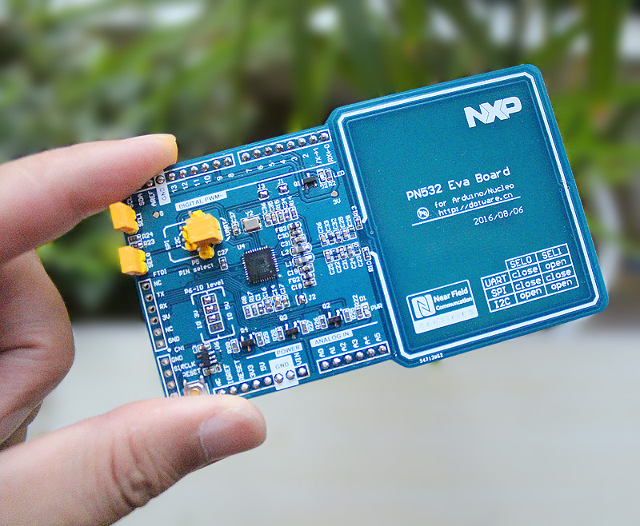
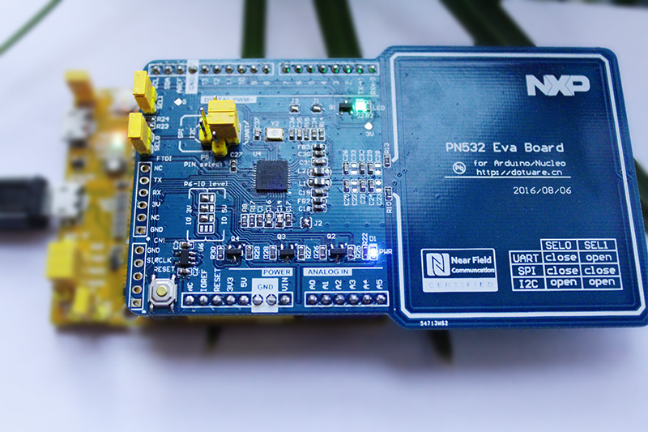

#PN532 evaluation board for arducleo

PN532 is widely used nfc chip. this evaluation board is suitable for mbed board, such as arducleo, st-nucleo; or the arduino uno board.

The libpn532 code is based on the [seeed-studio/pn532](https://github.com/Seeed-Studio/PN532 ""). It is for mbed platform, as a hsu/i2c/spi commnunication sample for arudcleo.

### Hardware Info
+ schematic [file](./doc/eva_pn532_sch_v1.1.pdf)
+ arduino uno pin compatiable
+ on board LDO for PN532
+ reset button for PN532
+ jumper for HSU/SPI/I2C interface.
+ FTDI interface for simple connection
+ a nfc status led
+ NXP nfc-se interface

### Mbed Pin used in sample
+ LED1 - arducleo on board led
+ PB_1 - arducleo on board buzzer
+ D9   - nfc status led
+ D4   - nfc chip reset pin
+ I2C - I2C_SDA, I2C_SCL
+ SPI - SPI_MOSI, SPI_MISO, SPI_SCK, SPI_CS
+ HSU - PC_10, PC_11
+ Dbg - SERIAL_TX, SERIAL_RX (as debug output)

### Software Features
+ Based on [seeed-studio/pn532](https://github.com/Seeed-Studio/PN532 "")
+ Supporting [mbed platform](https://developer.mbed.org/code/) & Working with mbed api. (works with ST-Nucleo board as well)
+ Support I2C, SPI and HSU of PN532
+ Read/write Mifare Classic Card
+ Works with [Don's NDEF Library](http://goo.gl/jDjsXl)
+ Communicate with android 4.0+([Lists of devices supported](https://github.com/Seeed-Studio/PN532/wiki/List-of-devices-supported))
+ Card emulation (NFC Type 4 tag)

### To Do
+ To support more than one INFO PDU of P2P communication
+ To read/write NFC Type 4 tag

### Getting Started
+ Easy way
  1. Download the repo zip file and extract the contents to a temperaroy folder(e.g. on windows d:\temp\eva_pn532).
  2. Copy {eva_pn532}/mdk/Nucleo_blink_led_f103rb.bin to your Arducleo/Nucleo virtual msc disk, you will get the sample running.
  
+ Keil MDK way (debug-able)
  1. Download the repo [zip file](https://github.com/dotnfc/eva_pn532/archive/master.zip) and extract the contents to a temperaroy folder(e.g. on windows d:\temp\eva_pn532).
  2. Download [Don's NDEF library](http://goo.gl/ewxeAe)， extract it into {eva_pn532}/libpn532/NDEF.
  3. Launch the Keil MDK project: {eva_pn532}/mdk/test_pn532_f103.uvproj.
  4. Compile and Link the sample, and Download it to the target board.

### Note
If you want to use this libpn532 in another board(such as nucleof072, nucleof401re, ...), you should download its mbed library from [mbed site](https://developer.mbed.org/compiler/), and unzip to {eva_pn532}/mbed.

### Contribution
This libpn532 is based on [seeed-studio/pn532](https://github.com/Seeed-Studio/PN532 "").

It's based on [Adafruit_NFCShield_I2C](http://goo.gl/pk3FdB). 
[Seeed Studio](http://goo.gl/zh1iQh) rewrite the library to make it easy to support different interfaces and platforms. 
@Don writes the [NDEF library](http://goo.gl/jDjsXl) to make it more easy to use. 
@JiapengLi adds HSU interface.
@awieser adds card emulation function.

&nbsp;